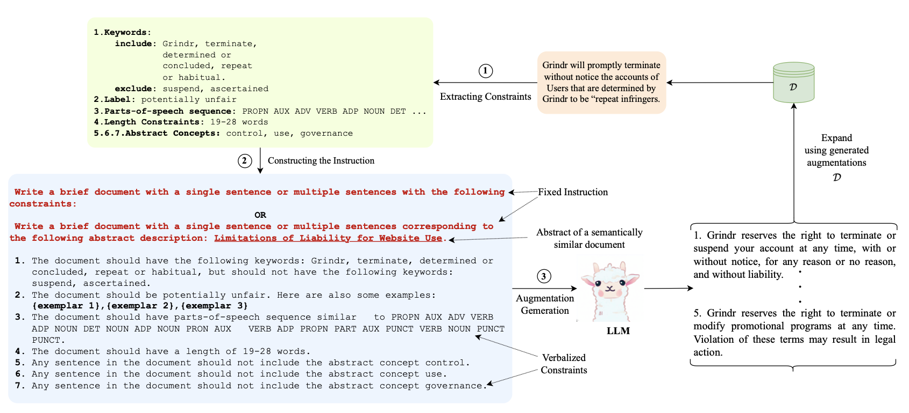

# CoDa : Constrained Generation based Data Augmentation for Low-Resource NLP

Implementation of [CoDa : Constrained Generation based Data Augmentation for Low-Resource NLP](https://arxiv.org/pdf/2404.00415)



### Constraint Generation:

1. For Classification tasks:

```shell
sh classification_pipeline.sh <dataset_name> <dataset_split> <debug_mode> <dataset_split_for_shortcut_grammar>

Example:
sh classification_pipeline.sh huff 500 0 train 
```

2. For NER tasks:

```shell
sh ner_pipeline.sh <dataset_name> <dataset_split> <debug_mode> <parts_of_speech_flag>

Example:
sh ner_pipeline.sh conll2003 500 0 0
```

### Training & Evaluation:
The scripts in the previous section generates synthetic augmentations and adds original data and places the combined data in `tsv_data/out_data`. The model can be trained further on original + synthetic data file and evaluated on the test split of the input dataset.


Note:
We use the following repositories to implement our methodology:
1. [Lexical-Substitution](https://github.com/jvladika/Lexical-Substitution)
2. [ShortcutGrammar](https://github.com/princeton-nlp/ShortcutGrammar)

---
**Please cite our work:**
```
@inproceedings{
      evuru2024coda,
      title={CoDa: Constrained Generation based Data Augmentation for Low-Resource {NLP}},
      author={Chandra Kiran Reddy Evuru and Sreyan Ghosh and Sonal Kumar and Ramaneswaran S and Utkarsh Tyagi and Dinesh Manocha},
      booktitle={2024 Annual Conference of the North American Chapter of the Association for Computational Linguistics},
      year={2024},
      url={https://openreview.net/forum?id=O5jNMEmc41}
}
```
